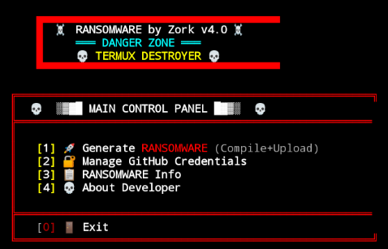

# 🧹 DroidSanitizer

<p align="center">
  
</p>

<p align="center">
  
  
  
  
</p>

<p align="center">
  <b>Advanced Android Security Assessment & Cleanup Simulation Framework</b>
</p>

---

## 📋 Overview

**DroidSanitizer** is an advanced Android security assessment and system cleanup simulation framework designed for **authorized penetration testing** and **security research** on Termux environments. This toolkit helps security professionals understand storage management, persistence mechanisms, and system optimization vectors in controlled lab environments.

> ⚠️ **IMPORTANT**: This project is intended **solely for educational purposes, authorized penetration testing, and security research** in isolated sandbox environments.

---

## 🎯 Purpose

This toolkit was developed for:

- 🔐 **Security Researchers** - Studying mobile threat vectors
- 🛡️ **Penetration Testers** - Authorized red-team engagements  
- 📚 **Students** - Learning about system security concepts
- 🏢 **Organizations** - Testing endpoint detection capabilities
- 🔬 **Malware Analysts** - Understanding persistence techniques

---

## ✨ Features

| Feature | Description |
|---------|-------------|
| **Payload Generator** | Creates test payloads for security assessments |
| **Persistence Simulation** | Demonstrates various persistence mechanisms |
| **Binary Compilation** | Converts scripts to compiled binaries using SHC |
| **Obfuscation Layers** | Base64 encoding and variable randomization |
| **Automated Deployment** | GitHub integration for payload distribution testing |

---

## 📁 Repository Structure

```
├── zorkwipe                   # Main DroidSanitizer tool
├── images/                    # Screenshots & banners
├── README.md                  # This documentation
└── LICENSE                    # MIT License
```

---

## ⚙️ Requirements

- **Termux** (Android terminal emulator)
- **bash** (default shell)
- **shc** (Shell Script Compiler)
- **curl** (for API interactions)
- **coreutils** (base64, etc.)

### Installation
```bash
pkg update && pkg upgrade -y
pkg install shc curl coreutils -y
```

---

## GitHub Token Setup

To use the GitHub upload feature, you need a Personal Access Token:

### Step 1: Generate Token
1. Go to [GitHub Settings → Developer Settings → Personal Access Tokens](https://github.com/settings/tokens)
2. Click **"Generate new token (classic)"**
3. Give it a name (e.g., `DroidSanitizer`)
4. Select expiration (recommended: 90 days)
5. Check these scopes:
   - ✅ `repo` (Full control of private repositories)
   - ✅ `delete_repo` (Optional)
6. Click **"Generate token"**
7. **Copy the token immediately** (you won't see it again!)

### Step 2: Save Token
When you run the tool, it will ask for:
- **GitHub Username**: Your GitHub username
- **GitHub Token**: Paste your token here

> ⚠️ **Keep your token secret!** Never share it publicly.

---

## 🚀 Usage

### Installation
```bash
git clone https://github.com/samay825/DroidSanitizer
```

### Permission
```bash
chmod +x zorkwipe
```

### Execute
```bash
./zorkwipe
```


---

## ⚠️ Legal Disclaimer

```
THIS SOFTWARE IS PROVIDED FOR EDUCATIONAL AND AUTHORIZED SECURITY 
TESTING PURPOSES ONLY.

BY USING THIS SOFTWARE, YOU AGREE TO THE FOLLOWING:

1. You have explicit written authorization to test the target systems
2. You will only use this in isolated lab/sandbox environments
3. You understand the potential consequences of misuse
4. You will not use this for any illegal or malicious purposes
5. You accept full responsibility for your actions

THE AUTHORS AND CONTRIBUTORS ARE NOT RESPONSIBLE FOR ANY MISUSE,
DAMAGE, OR ILLEGAL ACTIVITIES CONDUCTED WITH THIS SOFTWARE.

Unauthorized access to computer systems is a criminal offense in most
jurisdictions. Violation of computer crime laws may result in severe
civil and criminal penalties.
```

---

## 📜 Ethical Guidelines

This project follows responsible disclosure and ethical hacking principles:

- ✅ **Always obtain written permission** before testing
- ✅ **Use only in isolated environments** (VMs, sandboxes, lab devices)
- ✅ **Document all testing activities** for audit purposes
- ✅ **Report vulnerabilities responsibly** to affected parties
- ✅ **Never target systems without authorization**
- ✅ **Comply with all applicable laws** in your jurisdiction

---

## 🔒 Security Research Context

This toolkit demonstrates several security concepts commonly studied in:

- **OSCP** (Offensive Security Certified Professional)
- **CEH** (Certified Ethical Hacker)
- **GPEN** (GIAC Penetration Tester)
- **Mobile Security Research** (OWASP Mobile)

Understanding these techniques helps defenders build better protection mechanisms.

---

## 📚 References

- [OWASP Mobile Security Testing Guide](https://owasp.org/www-project-mobile-security-testing-guide/)
- [MITRE ATT&CK Mobile](https://attack.mitre.org/matrices/mobile/)
- [Android Security Documentation](https://source.android.com/security)
- [Termux Wiki](https://wiki.termux.com/)

---

## 🤝 Contributing

Contributions for improving detection signatures, adding defensive countermeasures, or enhancing documentation are welcome. Please ensure all contributions align with ethical security research practices.

---

## 📄 License

This project is licensed under the MIT License - see the [LICENSE](LICENSE) file for details.

```
MIT License

Copyright (c) 2026 Security Research Project

Permission is hereby granted, free of charge, to any person obtaining a copy
of this software and associated documentation files (the "Software"), to deal
in the Software without restriction, including without limitation the rights
to use, copy, modify, merge, publish, distribute, sublicense, and/or sell
copies of the Software, and to permit persons to whom the Software is
furnished to do so, subject to the following conditions:

The above copyright notice and this permission notice shall be included in all
copies or substantial portions of the Software.

THE SOFTWARE IS PROVIDED "AS IS", WITHOUT WARRANTY OF ANY KIND, EXPRESS OR
IMPLIED, INCLUDING BUT NOT LIMITED TO THE WARRANTIES OF MERCHANTABILITY,
FITNESS FOR A PARTICULAR PURPOSE AND NONINFRINGEMENT. IN NO EVENT SHALL THE
AUTHORS OR COPYRIGHT HOLDERS BE LIABLE FOR ANY CLAIM, DAMAGES OR OTHER
LIABILITY, WHETHER IN AN ACTION OF CONTRACT, TORT OR OTHERWISE, ARISING FROM,
OUT OF OR IN CONNECTION WITH THE SOFTWARE OR THE USE OR OTHER DEALINGS IN THE
SOFTWARE.
```

---

## 👤 Author

**Zork** - Security Researcher

---

<p align="center">
  <i>🛡️ Building better defenses through understanding offensive techniques 🛡️</i>
</p>

<p align="center">
  <b>Use Responsibly | Stay Ethical | Hack Legally</b>
</p>


